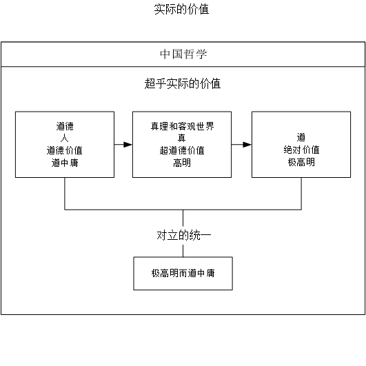

# I 中国哲学的精神

## 文稿

### 导言

**在中国哲学的历史中有个一以贯之的主流，或者说目标，我们称这个目标为中国哲学的精神。**在读具体的中国哲学史之前，先了解一下中国哲学的精神，可以帮助我们理解中国哲学发展的脉络，以及中国哲学中一些特有现象产生的原因。中国哲学的精神，冯先生在《新原道》一书中总结为“极高明而道中庸”。在这一章，我们会解释什么是“极高明而道中庸”，下一章则会介绍为什么中国哲学的精神会是“极高明而道中庸”。

### 概览

### 中国哲学与超乎实际的价值

在大多数人的观念中，哲学是一门象牙塔上的学问，与我们的日常并无关系，对我们的生活并无助益。确实，按照中国哲学的传统，了解哲学并不能增加任何关于实际的知识，不能给我们提供解决实际问题的具体方法。解决实际问题，可以直接或间接地提供实际的价值；但是人获取的并不只是实际的价值，人所追求的也不只是实际的价值。

举例而言，吃东西来果腹，获取的是实际的价值；吃好吃的东西，以求味觉上的刺激，获取的是更高的实际价值；但是很多人会怎么做呢？会把食物摆成好看的样子，然后拍照，发朋友圈。这样的行为并不能提供额外的实际价值，它们提供的是超乎实际的价值。我们问自己的人生有什么意义，人生的意义也是一种超乎实际的价值。

我们称基于物质的价值为实际的价值，基于精神的价值为超乎实际的价值。随着心理学和生物学的发展，曾经被认为基于精神的价值越来越多地得到了基于物质的解释，不过这就超出了我在这里想探讨的范围了。**中国哲学探讨的问题，大多是关于如何获取超乎实际的价值的。**

### 道中庸与道德价值

“中庸”一词出于《论语》（中庸之为德也，其至矣乎），在儒家学说中是最高的道德标准之一。冯先生在这里“借用”这个词，首先是用中庸来指代人伦日用。“道中庸”，即“以中庸为道”，也就是不脱离对现实事务的处理。对现实事务的处理，当然需要解决实际问题。我们前边说，解决实际问题，可以提供实际的价值；又说中国哲学关注的是超乎实际的价值。这是不是矛盾的呢？

超乎实际的价值基于人类的精神；具体而言，**相信**某种**行为规范**，然后采取**符合这一行为规范的行为**，就可以得到相应的超乎实际的价值。所以，解决实际的问题，可以提供实际的价值；当解决实际问题的行为符合人所相信的行为规范时，它同时也可以提供超乎实际的价值，两者并不冲突。

“中庸”是儒家的道德标准。道德标准是用于调节人与人之间的关系的行为规范，我们称道德标准对应的超乎实际的价值为道德价值。比如我的朋友生病了，我去ta家看望ta。我去看望生病的朋友，是因为我相信“人应该爱朋友”这样一条道德标准；通过遵循这样的道德标准，我也就获得了相应的道德价值（认为自己是道德的）。

所以，“道中庸”在这里不仅是指不脱离对现实事务的处理，而且个人对现实事务的处理需要符合“中庸”的道德标准，可以带来相应的道德价值。**以获取“中庸”的道德价值为目标的哲学，我们称其为“道中庸”的哲学。**至于“中庸”的道德标准具体是什么样的，我们在下一章进行说明。

### 高明与超道德价值

**人为什么要追求超乎实际的价值呢？我们可以说，因为实际的价值是有限的**。这种有限体现在两个方面。一方面是总量的有限，比如社会财富的总量在一定时期内是相对稳定的；另一方面，从生物学的角度而言，实际的价值对人的刺激是收益递减的。人的欲望是无穷的，就是因为稳定的实际价值依赖于不断提高的刺激。

那么，人是否可以满足于道德价值呢？道德价值依赖于道德标准，而道德标准是调节人与人之间的关系的行为规范。我应该去看望生病的朋友，是因为人应该爱朋友；可是如果我死了呢？对于死亡的恐惧，同样是大多数人的本能。如果道德价值无法超越个人的死亡，则人总会有不满足于道德价值的倾向。

当然，我们可以在不脱离人的前提下，对道德标准进行扩展。社会是人的集合，所以人与社会的关系，也在道德的范畴以内。道德价值，可以以他人和社会为媒介，超越个人在生理上的死亡。所以人会希望“流芳百世”，会愿意“为国捐躯”，会为了孩子放弃自己的生命，这些都超越了个人在生理上的生死。但是个体会被遗忘，朝代有其兴衰，文明终归衰亡。道德价值没有办法超越作为主体的人或者社会的存在和毁灭；人也总有会有不满足于道德价值的倾向。

**对于死亡的恐惧，或者说对于存在的渴望，驱使着人类追求超越死亡的价值**。这种价值，因为它超越了道德价值依赖的“人”，我们称它为超道德价值。**超道德价值一般依赖于客观世界或者非人的概念**。一个大家比较熟悉的超道德价值的例子是，“我爱我师，但我更爱真理”。“老师”的概念是基于人和人的关系的，受限于人的生死；而“真理”的概念可以超越人的生死。我会死，人类会毁灭，但我对真理的爱却藉由真理的永恒而永恒。我爱我师，得到的是道德价值；我更爱真理，得到的是超道德价值。**以获取超道德价值为目标的哲学，我们称其为“高明”的哲学**。

### 极高明与绝对价值

超道德价值超越了死亡。那么，人是否可以满足于超道德价值呢？我们说人天然有对存在的渴望。存在的极致，是永恒。真正的永恒，是什么也不依赖的。真理可以超越死亡，但是依然无法超越概念；或者说，先有真理的概念，才谈得上爱真理。有什么东西，能够符合真正的永恒的标准呢？

中国古代的哲学家们给出的回答是“道”。道超越了可知可思的一切，可知可思的一切都源于道。因为它超越了一切，所以我们可以说它是绝对的。于是，通过制定人与绝对的道之间的关系的行为规范，并且采取符合这一行为规范的实际行为，我们就可以获取绝对的超道德价值，我们将其简称为绝对价值。**对于永恒的追求，驱使着人类追求绝对价值**；**以获取绝对价值为目标的哲学，我们称其为“极高明”的哲学**。

### 对立的统一：而

什么样的行为规范，可以调节人与绝对的道之间的关系呢？中国古代哲学家们给出的回答是，提升我们的精神境界，以至于“道与我为一”。关于什么是“道”，什么是“道与我为一”，我们会在后续的章节中进行说明；现在我们只需要知道，个人想要达到这样的境界，他的眼光必须超越社会超越生死。

我上大学的时候说，到北京是为了“看到更广大的世界”——为了看到比我的家乡更大的世界，我需要离开我的家乡。那么想要让自己的眼光超越社会超越生死，我们是不是就必须要离开社会，甚至否定“生”呢？佛家中一些流派的答案是肯定的，所以人活着的时候需要“出家”，而“生”则是人生痛苦的根源。但是中国古代的哲学家们并不满足于这样的答案。**生而为人，则不应该脱离“生”；生而有父母，则不应该脱离社会**。他们既希望达到“道与我为一”的至高境界，从而获取绝对价值；又希望遵循一定的道德标准，很好地处理现实事务，从而获取道德价值。也就是说同时存在“极高明”和“道中庸”两个目标。

居于社会中而超越社会，听上去就好像是要在水里生火一样，是非常矛盾的。对立的目标是否可以统一起来呢？举一个例子，我们可以问，一个人是要遵从自己内心，还是向环境屈服。对此，儒家学说给出的答案是“尽人事，听天命”——既遵从自己的内心，又顺从于无法改变的环境；不仅如此，了解并顺从不可改变的环境，正是遵从自己内心的最佳实践。矛盾被解决了，但并不是通过否定一方而肯定另一方的方式解决的，而是使得矛盾不成其为矛盾了。**对立的目标被统一成一个更高的目标，原本的对立也就不存在了**。

如何将“极高明”和“道中庸”这的两个对立的目标统一起来，就是中国哲学所求解决的问题；中国哲学之精神，也就在于此，即开篇所说的“极高明而道中庸”。它最终指向“道与我为一”的至高境界，同时也并不脱离对现实中问题的处理。不仅如此，**按照一定的道德标准处理好现实中的问题，正是他达成这种境界的最佳实践**。

### 总结

中国哲学探讨的问题，是关于如何获取超乎实际的价值的。中国哲学的精神，可以总结为“极高明而道中庸”；也就是说，中国哲学希望人们按照“中庸”的道德标准处理现实事务，并通过这么做来达到“道与我为一”的境界，进而同时获取道德价值和绝对价值。

获取了这种绝对价值的人永远是快乐的。这种快乐虽然常常表现为情绪上的快乐，但并不仅限于情绪，而是更高层次的快乐。它包含了儒家所说的“人不堪其忧，回也不改其乐”，在道家则谓之“逍遥”。所以，我为这份读书笔记另起了一个名字，叫做《成为一个快乐的人》。

### 延伸

#### 哲学，概念，和系统化

数学，是系统的关于数字的思想；建筑学，是系统的关于建筑的思想；而哲学，在《中国哲学简史》中指的是系统的关于人生的思想。对思想进行系统化的过程中，就会产生种种概念。

哲学为什么需要系统化需要概念呢？概念是对思想进行抽象的产物。讲概念的过程，也就是名家所谓“正名”的过程。“正名”的目的是为了“析理”。人不能直接地感知他人的思想，也不能直接地把自己的思想传递给他人。概念明确了，才有探讨思想的基础。比如你一定要管自己的床叫“桌子”，告诉别人“我的桌子睡起来很舒服”，这显然是会为交流带来障碍的。甚至，你终究得给实际的床一个名字，否则你就无法形成“我的床睡起来很舒服”这个思想。

需要注意的是，在这里我们在一定程度上混淆了“概念”和“语言”。关于“概念”和“语言”的进一步分析，同样超出了我在这里想要探讨的范围，只在这里引用一个观点——语言是梯子。理解了语言的内涵之后，语言就不是必要的了。类似地，按照中国哲学的传统，概念也是梯子；理解了“理”，概念就不是必要的了；理解了“道”，一切概念不仅不是必要的，反而有可能成为一种阻碍，这就是为什么道家主张“为道日损”，“得意忘言”。

尽管分析概念和形成系统对某些人来说非常有趣，但是很多人并不喜欢概念。哲学，作为纯粹的思想的创造，概念似乎格外地多且抽象，甚而让人有一种**哲学只是概念的堆积**的**错觉**。也有一些哲学流派，过于关注概念的细节，以至于忽略了哲学的基本问题。所以我个人认为，在读哲学，尤其是初读哲学的时候，适当的“不求甚解”对于理解核心的“理”乃至“道”而言是有帮助的。所以我将一些不影响主线的概念辨析放在了延伸内容中。

#### 哲学的范畴

西方哲学将哲学分为三大部——宇宙论，人生论，和知识论。伦理学属于人生论，逻辑学属于知识论，唯心主义和唯物主义属于宇宙论。要对思想进行系统化，使得思想不会自相矛盾，就需要用到知识论；宇宙是人生的舞台，人生论与宇宙论的关系，可以类比于质能转换方程与相对论的关系。所以，哲学虽然被分为三个部分，但都是系统的关于人生的思想。

需要注意的是，宇宙论和物理学是有很大差异的。简单来说，在我所知的范围以内，自洽的宇宙论都是不可证伪的，与经典力学和相对论这样实际的理论是兼容的。更进一步的探讨，可以等到我们去谈阴阳家的宇宙生成论的时候再进行。

#### 价值，实际的价值，与功利的价值

价值是驱动人自发的行为的力量。这并不是说人的行为被某一个别的什么所驱使，而是说我们把一切驱使人采取自发的行为的力量称为价值。单纯的语言学的问题。

前文中提到，我认为超乎实际的价值来源于**相信**一定的行为规范并采取符合规范的实际行为。但是我在关于道德价值和超道德价值的论述中没有对行为规范的内容做任何限定。这是因为，在我看来，行为规范的内容并不影响价值的性质和获取。如果“爱他人”可以获得道德价值，那么“爱自己”呢？如果爱上帝可以获得超道德价值，那么爱魔鬼呢？由此我们可以得到一些有趣的结论。

一个人贪恋实际的好处，我们往往说ta很“功利”。那么，功利的价值到底是实际的价值还是超乎实际的价值呢？依我个人的观点，功利的价值是不仅是超乎实际的价值，而且正是通过“爱自己”得到的道德价值。参考我关于道德价值的例子，当我相信“人应该爱朋友”这样一条道德标准时，通过“看望朋友”这一符合该道德标准的实际行为，我可以获取道德价值；类似地，当我相信“人应该爱自己”这样一条道德标准时，通过“贪恋实际的好处”这一符合该道德标准的实际行为，我也可以获得相应的道德价值，我们把这种道德价值成为功利的价值。有趣的是，“爱自己”与很多我们习以为常的道德标准其实并不冲突。在后续介绍墨家思想的时候，我们可以看到一个以“爱自己”为核心道德标准的道德体系可以是什么样的。

#### 道德与自然

我在定义道德的时候说，道德是用于调节人与人之间的关系的行为准则。那么，调节人与自然关系的行为准则，是否属于道德呢？必须承认我在这里还没有特别笃定的理解。不过我倾向于认为，不属于。

人为什么要爱地球呢？一个方向的解释是，因为地球是我们共同的家园。人要爱自己的家园；换言之，如果地球不是我们的家园，我们也就不必爱它。比如人可能不必爱火星。另一个方向的解释是，万物有灵，地球也有地球的灵，所以我们要爱地球。这个时候，实际上是对“人”这一概念进行了泛化。于是人可能不必爱无灵的死物。

这样，我们就把通常所言人与自然的关系，归入了人与人的关系的范畴。我不确定这样的划分是否有些牵强，但不如此则无法很好地解释超道德价值是如何超越了道德，而不是别的什么。如果把超越物质世界的存在与毁灭，或者外部世界的影响作为评判标准，则这个价值将不以道德为分界线，而以形象为分界线。

#### 愿上帝与你同在

基督教中有一个祝福语叫“愿上帝与你同在（may god be with you）”。一种形象化的解释是，希望上帝保佑你免受“恶”的袭扰，听起来就有一种“白胡子老爷爷慈爱地看着你”的感觉；但是基督教中同样有一句话叫“神无处不在（The eyes of the LORD are everywhere）”。神既然无处不在无所不知，岂不是永远与所有人同在么？

参考我们对超道德价值的讨论，可以得出另一种解释。“神”并不是某个人格化的存在，而是超越人的；更进一步说，“神”和“道”或者“一”是类似的——世间万物与其说是神的创造物，不如说是神形象化的产物，所以世间万物都是神，或者说神的“影子”，所以“神无处不在”。而“愿上帝与你同在”，并不是说希望上帝和我站在一起，甚至暗示着上帝可能不与我同在，而是希望我可以觉知到“上帝与我为一”这个事实。觉知到这个事实，也就觉知到了“超越人的神”。

认识到上帝的超越性，与上帝的约定也就有了超越性，《新约》和《旧约》中“约”都是指这样的约定；通过遵循与上帝的约定，或者说“爱上帝”，其获取的价值就也具备了这种超越性。这就是由宗教以获取超道德价值的具体方法。

不过，出于传播的目的，宗教中的神往往走向人格化，比如我们将上帝称为“我们在天上的父”。人格化的神，如希腊神话中的众神，不过是更加强大的人而已。与这样的神定约得到的超道德价值，也就不是真正的超道德价值。

#### 中国哲学家表达自己思想的方式

有朋友和我说，看西方的哲学著作很累，但是看《论语》就很轻松，也没有什么难以理解的概念。且不提《论语》是否完全出于对现实对话的忠实记录，至少从形式上来说，《论语》是由很多简短的言论或对话构成的，而且上下章几乎没有联系。另一方面，从《论语》中又确实能见到孔子哲学的全体。

这其中的一个重要原因是，《论语》实际上并不是正式的哲学著作，因而行文上不需要有系统性，上下章之间也不需要有联系。实际上，中国古代的大多数哲学家们不写正式的哲学著作，也不认为自己是职业的哲学家。这是因为，在古代中国，哲学很大程度上取代了西方文化中宗教的地位。每个人都要学哲学。学哲学的目的，是使人作为人能够成为人。中国哲学既然要求它的践行者们解决好现实中的问题，中国的哲学家们也就并不认为自己应该止于哲学，进而纷纷提出自己的政治思想。这与中国哲学之精神中的“道中庸”是一致的。

另一方面，在中国哲学史中，即使是正式的哲学著作，相较于西方的哲学著作也不够明晰，反而有很多名言隽语。名言隽语当然很简短。它们富于暗示性，却不够明晰。我们说“极高明”需要超越概念，它的基础是“无名之名”，从中衍生出“通过取消来超越”的倾向。这种倾向表现在文字作品中，就使得文字偏向于暗示而非明晰，也就是我们常说的“言有尽而意无穷”。中国哲学著作富于暗示的特点，与中国哲学之精神中的“极高明”是一致的。

